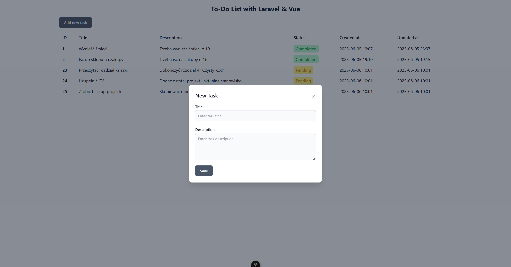

# To-Do List

Prosty system zarządzania zadaniami z możliwością dodawania, edytowania, usuwania oraz oznaczania zadań jako ukończone. Projekt składa się z backendu PHP (Laravel) oraz frontendowej aplikacji w Vue.js z Tailwind CSS.

# Backend

Instrukcja instalacji części backendowej

    cd backend/
    composer install
    php artisan serve
Serwer działa na adresie http://127.0.0.1:8000 albo na http://localhost:8000
Do repozytorium jest dodany plik database.sql, więc migracja nie jest wymagana.
    

# Frontend

Aby uruchomić część frontendową należy wykonać polecenia

    cd frontend/
    npm install
    npm run dev
Serwer działa na adresie http://localhost:5173/
